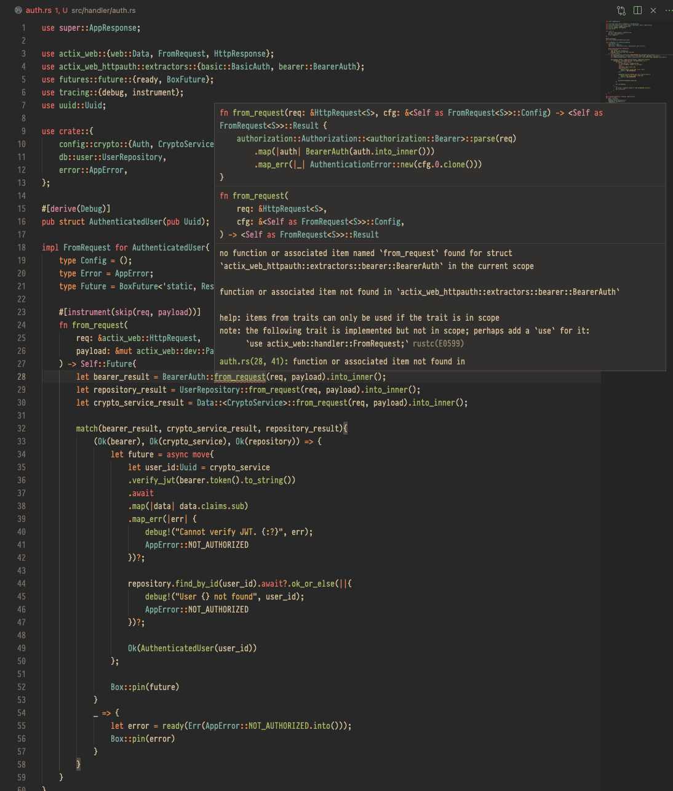

A literal follow-up with the tutorial, provided by <i>Genus-v Programming</i>, on [Youtube - Playlist](https://www.youtube.com/playlist?list=PLECOtlti4Psqw1qRaN4R9sWSQWvqfJU_V).

This is the original [Github repo](https://github.com/nemesiscodex/user-auth)

This repo does not work with the error: 
